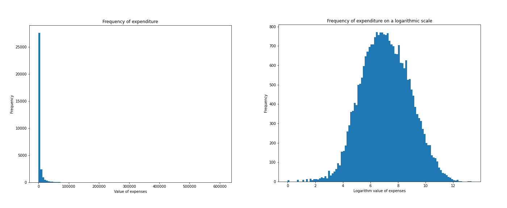
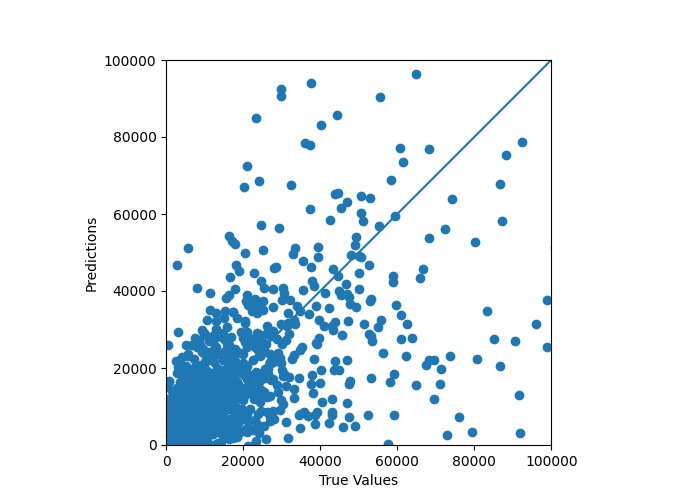

---
output:
  pdf_document: default
  html_document: default
---
# Story Meps: regression


*Authors:  Anna Kozioł (Warsaw University of Technology), Katarzyna Lorenc (Warsaw University of Technology), Piotr Podolski (University of Warsaw)*

*Mentors:  Maciej Andrzejak (Affiliation 2), Alicja Jośko (Affiliation 1)*

## Introduction 

As many opinions as people about healthcare financing. 

The aim of the project is to predict medical expenses based on demographic and socio-economic variables.

The Medical Expenditure Panel Survey provides data on health care as well as related costs. Data for the MEPS project has been collected regularly since 1996.
Each year, approximately 15,000 households are selected as a new panel of surveyed units.


## Model

### Data
Agency of Healthcare Research and Quality provides an extensive database of medical expenses. Consequently, dataset selection on which we will make further analysis was an important first step. We decided to choose the two latest panels. Expenditures for treatment that we will examine in the following chapter apply to the years 2015/2016 and 2016/2017. The selected dataset contains information on over 32,000 patients, and each of them is described by 3,700 variables. We attached great importance to choosing features that would be appropriate for the prediction. The most important criterion adopted is that the variable cannot relate to expenditure associated with any treatment. For this purpose, we looked through several hundred of them and selected 387 most suitable.

As a part of the preprocessing, we removed records that were marked as *Inapplicable* in the expenditure column.  The number of people who didn't incur expenses is 5504, while the number of patients with "inapplicable" is 407, the percentage respectively are 17% and 1%. The following figures show the distribution of the explained variable.

```{r setup, include=F}
install.packages("rmarkdown", repos="http://cran.r-project.org")
install.packages("knitr", repos="http://cran.r-project.org")
install.packages("reticulate", repos="http://cran.r-project.org")
install.packages("bookdown", repos="http://cran.r-project.org")

library(reticulate)
use_python("/Users/piotrpodolski/Desktop/projects/IML/bin/python3")
knitr::knit_engines$set(python = reticulate::eng_python)
matplotlib <- import("matplotlib")
matplotlib$use("Agg", force = TRUE)
```


```{r, cache=FALSE, out.width = "1400",fig.cap = "Distribution of medical expenses ", fig.align="center",echo=FALSE}

```

    


### Model
Among the models we have trained, the best results were achieved by Gradient Boosting. Due to the characteristics of the explained variable, we decided to check the behavior of the model after applying the logarithmic transformation to expenses. We also checked whether the not inclusion of people without medical expenses would affect the model. To choose the best model, we compared the determination coefficient values. 

The table below shows the results of the experiments. To calculate the determination coefficient in column  *$R^2$ (logarithmically transformed expenses)*, we transformed logarithmically the values of expenses, and after training the model we returned to the original scale.


| Patients without expenses | Model | $R^2$ | $R^2$ (logarithmically transformed expenses) | 
|----------------|-----------------------------------------------------------------------|------------------------------------------|--------------------------------------------------------|
| included | Gradient Boosting | 0.50 | - |
| included | Tuned Gradient Boosting | 0.55 | - |
|not included | Gradient Boosting | 0.42 | 0.40 |
|not included| Tuned Gradient Boosting | 0.49 | 0.49 |
Table: Values of the determination coefficient.


```{python, include=FALSE}
import pandas as pd
import numpy as np
import matplotlib.pyplot as plt
import pandas as pd
import tensorflow as tf
import seaborn as sns
import lime.lime_tabular as lt

from sklearn.model_selection import train_test_split
from sklearn.metrics import r2_score
from sklearn.linear_model import LinearRegression
from sklearn.ensemble import GradientBoostingRegressor
from sklearn.model_selection import train_test_split
from aix360.datasets import MEPSDataset
from dalex import explainer
from ceteris_paribus.explainer import explain as ct_explainter
from ceteris_paribus.profiles import individual_variable_profile
from ceteris_paribus.plots.plots import plot
from sklearn.inspection import permutation_importance


pd.options.display.max_columns = 150

def data_extractor():
    h193 = pd.read_csv("/Users/piotrpodolski/Desktop/projects/iml_notebooks/h193.csv")
    h202 = pd.read_csv("/Users/piotrpodolski/Desktop/projects/iml_notebooks/h202.csv")
    file = open("/Users/piotrpodolski/Desktop/projects/iml_notebooks/selected_features.txt","r")
    features = [feature.split("\n")[0] for feature in file.readlines()]
    features.append("TOTEXPY1")
    join_columns = [col for col in h202.columns if col in h193.columns]
    data = pd.concat([h193[join_columns], h202[join_columns]]).drop("Unnamed: 0",1)[features].reset_index(drop=True)

    return data[data.TOTEXPY1>=0]
    
def show_permutation_importance(model_name, model, x, y, img_name, **kwargs):
    
    print(f"model:{model_name}")
    max_index = kwargs.pop('max_index') if 'max_index' in kwargs else len(x.columns)
    
    result = permutation_importance(model, x, y, **kwargs)
    sorted_idx = result.importances_mean.argsort()[-max_index:]

    fig, ax = plt.subplots(figsize=(16,20))
    ax.boxplot(result.importances[sorted_idx].T, vert=False, labels=x.columns[sorted_idx])
    ax.set_title(f"Permutation Variable Importances for {model_name}")
    plt.savefig(f"images/team5/{img_name}.jpeg")

    
def score_r2_print(clf, X_train, X_test, y_train, y_test):
    print('Training R^2:', r2_score(y_train, clf.predict(X_train)))
    print('Test R^2:', r2_score(y_test, clf.predict(X_test)))
```

```{python, include=FALSE}
data = data_extractor()
X, y = data.drop({'TOTEXPY1'}, 1), data['TOTEXPY1']
X_train, X_test, y_train, y_test = train_test_split(X, y, test_size=0.2, random_state=37)
```


```{python, , include=FALSE}
gbr = GradientBoostingRegressor(
    max_depth=5, 
    learning_rate=0.05, 
    min_samples_leaf=9, 
    n_estimators=434, 
    random_state=7, 
    max_features=1.0
)
gbr.fit(X_train, y_train)
```

```{python, echo=FALSE}
y_pred_gbr = gbr.predict(X_test)
test_predictions = gbr.predict(X_test)
a = plt.axes(aspect='equal')
plt.scatter(y_test, test_predictions)
plt.xlabel('True Values')
plt.ylabel('Predictions')
lims = [0, 100000]
plt.xlim(lims)
plt.ylim(lims)
plt.plot(lims, lims)
plt.savefig("images/team5/results.jpeg")

```

```{r, cache=FALSE, out.width = "1400",fig.cap = "Distribution of medical expenses ", fig.align="center",echo=FALSE}

```

```{python}
score_r2_print(gbr, X_train, X_test, y_train, y_test)
```

## Explanations
### 2. Feature importance
#### 2.1 Feature importance using permutation importance

```{python, echo=FALSE}
show_permutation_importance('Gradient Boosting Regressor', gbr, X_test, y_test, 'feature_importance', n_repeats=10, max_index=30)
```
```{r, cache=FALSE, out.width = "1400",fig.cap = "Distribution of medical expenses ", fig.align="center",echo=FALSE}
knitr::include_graphics("images/team5/feature_importance.jpeg")
```

### 3. Explaining predictions for selected cases of data

```{python, include=FALSE}
exp = explainer.Explainer(model=gbr, data=X_train, y=y_train, model_type='regression')
```
#### 3.1 Prediction explanation using Break Down Plots
```{python, include=FALSE}
exp_bd_gbr = exp.predict_parts(X_train.iloc[0], type='break_down')
```

```{python, echo=FALSE}
plot = exp_bd_gbr.plot(show=False, max_vars=40)
plot.write_image("images/team5/break_down.jpeg")
```

```{r, cache=FALSE, out.width = "1400",fig.cap = "Distribution of medical expenses ", fig.align="center",echo=FALSE}
knitr::include_graphics("images/team5/break_down.jpeg")
```

#### 3.2 Prediction explanation using Break Shapley Values
```{python, include=FALSE}
exp_shap_gbr = exp.predict_parts(X_train.iloc[0], type='shap')
```

```{python, echo=FALSE}
eplot = xp_shap_gbr.plot(show=False, max_vars=40)
plot.write_image("images/team5/shap.jpeg")
```

```{r, cache=FALSE, out.width = "1400",fig.cap = "Distribution of medical expenses ", fig.align="center",echo=FALSE}
knitr::include_graphics("images/team5/shap.jpeg")
```

#### 3.3 Prediction explanation using LIME

```{python, include=FALSE}
lime_explainer = lt.LimeTabularExplainer(
    X_train.values,
    feature_names=X_train.columns.values.tolist(),
    class_names=['price'],
    categorical_features=categoricalCols,
    verbose=True, 
    mode='regression'
)
lime_exp_obs1 = lime_explainer.explain_instance(X_train.values[0], gbr.predict, num_features=20)
plot = lime_exp_obs1.as_pyplot_figure()
plot.savefig("images/team5/lime.jpeg")

```
```{r, cache=FALSE, out.width = "1400",fig.cap = "Distribution of medical expenses ", fig.align="center",echo=FALSE}
knitr::include_graphics("images/team5/lime.jpeg")
```
## Summary and conclusions 
All key information about the final model we will put in this section.


Scripts and list of selected variables are available at: [meps_story github](https://github.com/lorenckat/meps_story).
